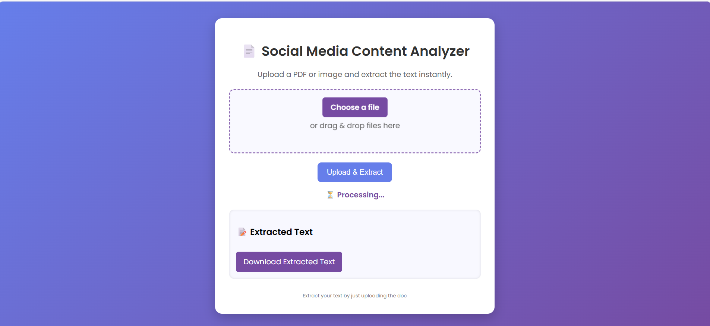
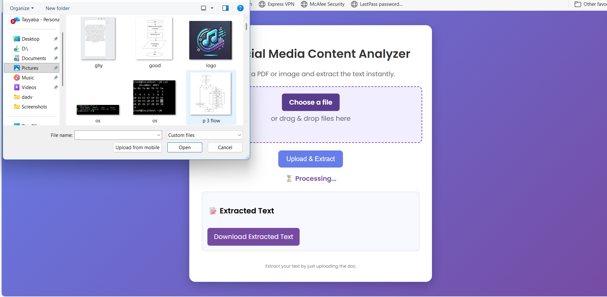
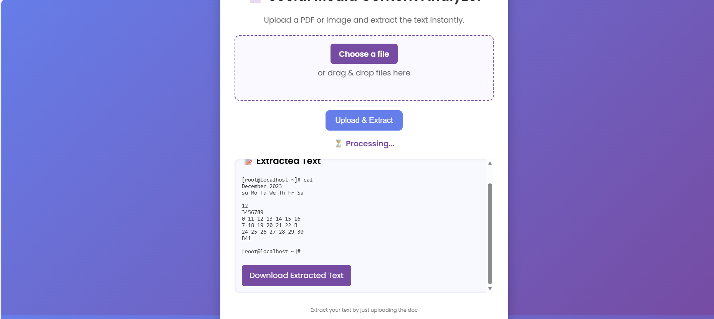

# social-media-content-analyzer

A simple and user-friendly web app that extracts text from images and PDF files.
It supports scanned images using OCR (Tesseract) and gives instant results with a clean interface.

**✨ About This Project**

This tool helps you upload any document—PDF or image—and extract readable text from it.
It is useful for:

Notes and assignments

Scanned pages

Screenshot text

PDF content

Image-based documents

The main goal was to make the app clean, fast, and easy to use.

**🚀 Features**

Upload PDF or Image

Drag-and-drop support

Extract text instantly

OCR support for scanned images

Modern and simple UI

Download text as .txt file

Loading indicator

Handles invalid files gracefully

## 🖼️ Screenshots
### 🔹 Home Page (Upload Interface)


### 🔹 Choose File Screen


### 🔹 Extracted Text Output


### Download Extracted Text


**🛠️ Tech Stack**

Python (Flask) — Backend

Tesseract OCR — Text extraction

pdfplumber / pdf2image — PDF processing

HTML, CSS, JavaScript — Frontend

## 📦 Project Structure

```
📦 social-media-content-analyzer
├── app.py
├── requirements.txt
├── LICENSE
├── .gitignore
├── README.md
├── templates/
│   └── index.html
├── static/
│   ├── css/
│   │   └── style.css
│   ├── js/
│   │   └── script.js
│   └── screenshots/
│       ├── choose_file.png
│       ├── homepage.png
│       └── extracted_text.png
├── uploads/
│   └── .gitkeep
```


🧑‍💻 How to Run the Project
1. Install dependencies
pip install -r requirements.txt

2. Install Tesseract OCR

Download from:
https://github.com/tesseract-ocr/tesseract

Make sure the path is:

C:\Program Files\Tesseract-OCR\tesseract.exe

3. Start the application
python app.py

4. Open in browser
http://127.0.0.1:5000

**📄 License**

This project is protected under the MIT License.


**Author**
**Tayyaba Khan**
